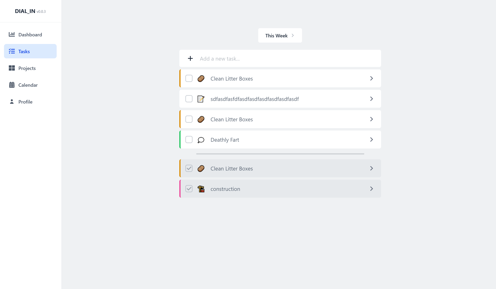

### DIAL-IN

DIAL-IN is a planning app for managing tasks, projects, recurring routines, and scheduled work in one place. It combines focused task lists, project-based organization, rule-driven task generation, visual task metadata, and day/week/month calendar views for seeing work over time.

Some planned features for future updates:

- Clear source-rule visibility and controls on generated tasks
- Priority, subtasks, and progress tracking
- Richer calendar interactions, including drag-to-reschedule and quick-create from date cells
- Dashboard analytics for completion trends, rule effectiveness, and project progress
- Sharing/collaboration, custom themes, and broader accessibility controls
